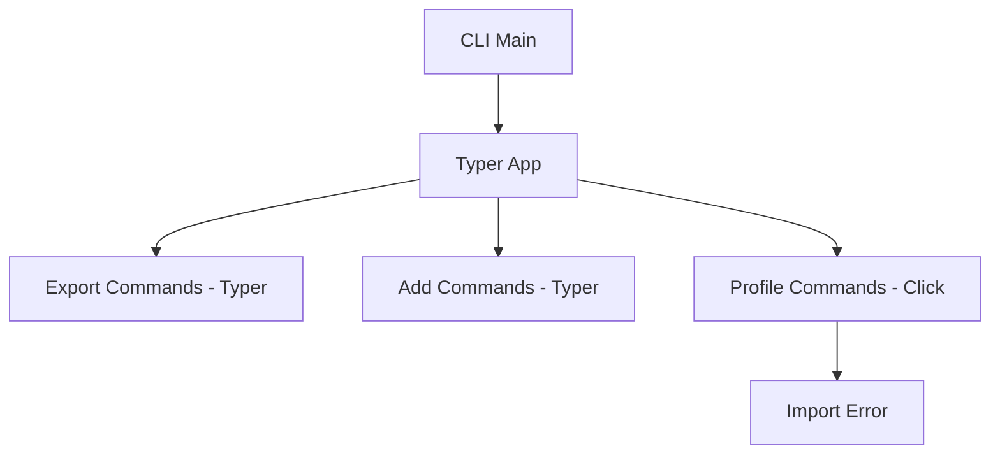
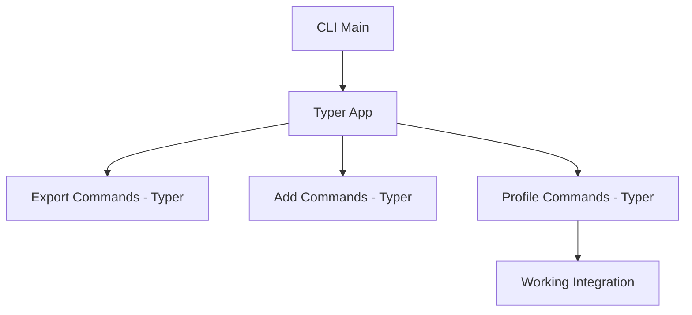

# Fix CLI Import Error: Convert profile_cmd.py from Click to Typer

**Date**: 2025-09-01
**Author**: Roo (Architect Mode)
**Status**: Ready for Implementation
**Priority**: HIGH

## Executive Summary

The AI Context Manager CLI is failing to start due to an ImportError in the profile command module. The issue stems from framework inconsistency where `profile_cmd.py` uses Click while the rest of the CLI uses Typer. This plan outlines a systematic conversion to resolve the import error and maintain codebase consistency.

## Problem Statement

**Error**: `ImportError: cannot import name 'app' from 'ai_context_manager.commands.profile_cmd'`

**Root Cause**: `profile_cmd.py` uses Click framework with a `@click.group()` named `profile`, but the CLI expects all command modules to export a Typer `app` variable.

**Impact**: CLI completely non-functional, blocking all profile management operations.

## Current State Analysis

### ✅ Working Components
- Main CLI (`cli.py`) - Uses Typer
- Export commands (`export_cmd.py`) - Uses Typer with `app = typer.Typer()`
- Add commands (`add_cmd.py`) - Uses Typer with `app = typer.Typer()`
- Configuration system (`config.py`) - Includes `get_config_dir()` function
- Core modules (`profile.py`, `file_utils.py`, `token_counter.py`) - Functional

### ❌ Broken Components
- Profile commands (`profile_cmd.py`) - Uses Click instead of Typer
- CLI initialization - Fails on import due to missing `app` variable

## Solution Overview

Convert `profile_cmd.py` from Click to Typer framework while preserving all existing functionality. This involves:

1. Framework migration (Click → Typer)
2. Decorator conversion
3. Parameter system updates
4. Output method standardization

## Implementation Phases

### Phase 1: Framework Migration
**Duration**: 30 minutes
**Risk Level**: LOW
**Dependencies**: None

#### Objectives
- Replace Click imports with Typer imports
- Create Typer app instance
- Update main group decorator

#### Tasks
1.1 Replace import statements
   - Remove: `import click`
   - Add: `import typer`
   - Add: `from rich.console import Console` (for consistent output)

1.2 Create app instance
   - Add: `app = typer.Typer(help="Manage export profiles")`
   - Add: `console = Console()`

1.3 Convert main group
   - Change: `@click.group()` → `@app.callback()`
   - Update function name if needed

#### Success Criteria
- File imports successfully without errors
- App instance created correctly
- Main callback function defined

### Phase 2: Command Conversion
**Duration**: 45 minutes
**Risk Level**: MEDIUM
**Dependencies**: Phase 1 complete

#### Objectives
- Convert all Click command decorators to Typer
- Update function signatures
- Maintain command functionality

#### Tasks
2.1 Convert create command
   - Change: `@profile.command()` → `@app.command()`
   - Convert: `@click.argument('name')` → `name: str` parameter
   - Convert: `@click.option()` → function parameters with defaults
   - Update: `click.echo()` → `console.print()` or `typer.echo()`

2.2 Convert list command
   - Change: `@profile.command()` → `@app.command()`
   - Remove Click-specific parameters
   - Update output methods

2.3 Convert show command
   - Change: `@profile.command()` → `@app.command()`
   - Convert argument to parameter
   - Update output formatting

2.4 Convert load command
   - Change: `@profile.command()` → `@app.command()`
   - Convert argument to parameter
   - Preserve file loading logic

2.5 Convert delete command
   - Change: `@profile.command()` → `@app.command()`
   - Convert argument to parameter
   - Preserve confirmation logic

2.6 Convert update command
   - Change: `@profile.command()` → `@app.command()`
   - Convert arguments and options to parameters
   - Preserve update logic

2.7 Convert export command
   - Change: `@profile.command()` → `@app.command()`
   - Convert arguments and options to parameters
   - Preserve export functionality

2.8 Convert import command
   - Change: `@profile.command()` → `@app.command()`
   - Convert file path argument
   - Preserve import logic

2.9 Convert migrate command
   - Change: `@profile.command()` → `@app.command()`
   - Convert options to parameters
   - Preserve migration logic

#### Success Criteria
- All commands converted to Typer decorators
- Function signatures updated appropriately
- Output methods standardized

### Phase 3: Parameter System Updates
**Duration**: 30 minutes
**Risk Level**: MEDIUM
**Dependencies**: Phase 2 complete

#### Objectives
- Update all function parameters to use Typer conventions
- Handle optional parameters correctly
- Preserve type hints and validation

#### Tasks
3.1 Update Path parameters
   - Change: `@click.Path(path_type=Path)` → `path: Path`
   - Add proper imports for Path

3.2 Update boolean options
   - Change: `@click.option()` with flags → `param: bool = False`

3.3 Update string options with prompts
   - Change: `@click.option(prompt=True)` → `param: str = typer.Option(..., prompt=True)`

3.4 Update file path arguments
   - Change: `@click.argument(type=click.Path(exists=True))` → `file_path: Path`

#### Success Criteria
- All Click-specific parameter decorators removed
- Typer parameter system fully implemented
- Type hints preserved and correct

### Phase 4: Error Handling and Output
**Duration**: 20 minutes
**Risk Level**: LOW
**Dependencies**: Phase 3 complete

#### Objectives
- Standardize error handling
- Update output methods
- Ensure consistent user experience

#### Tasks
4.1 Replace Click exceptions
   - Change: `click.ClickException` → `typer.Exit()` or `console.print()`
   - Update error message formatting

4.2 Standardize output methods
   - Change: `click.echo()` → `console.print()` (preferred)
   - Alternative: `typer.echo()` for simple output

4.3 Update confirmation prompts
   - Change: `click.confirm()` → `typer.confirm()`

#### Success Criteria
- All Click-specific output methods replaced
- Error handling consistent with Typer patterns
- User experience maintained

### Phase 5: Testing and Validation
**Duration**: 25 minutes
**Risk Level**: LOW
**Dependencies**: All previous phases complete

#### Objectives
- Verify CLI starts without import errors
- Test basic command functionality
- Ensure no regressions

#### Tasks
5.1 Import validation
   - Run: `python -c "from ai_context_manager.commands.profile_cmd import app"`
   - Verify no import errors

5.2 CLI startup test
   - Run: `python -m ai_context_manager.cli --help`
   - Verify profile commands appear in help

5.3 Basic command tests
   - Test: `python -m ai_context_manager.cli profile --help`
   - Test: `python -m ai_context_manager.cli profile list`
   - Verify command structure and output

#### Success Criteria
- CLI starts without ImportError
- Profile commands accessible via CLI
- Basic functionality preserved

## Risk Assessment

### Low Risk Items
- Import statement changes
- App instance creation
- Basic decorator conversion

### Medium Risk Items
- Parameter conversion (potential type/validation issues)
- Complex command logic preservation
- Output formatting changes

### Mitigation Strategies
- Backup original file before changes
- Test each command individually
- Compare output with original Click version
- Use git for version control

## Dependencies and Prerequisites

### Required Knowledge
- Typer framework fundamentals
- Click to Typer migration patterns
- Python type hints
- Rich console output

### Environment Requirements
- Python 3.8+
- All dependencies from `requirements.txt`
- Virtual environment activated

## Success Metrics

### Functional Metrics
- ✅ CLI starts without ImportError
- ✅ All profile commands accessible
- ✅ Command help displays correctly
- ✅ Basic command execution works

### Quality Metrics
- ✅ Code follows Typer best practices
- ✅ Consistent with other command modules
- ✅ Type hints preserved
- ✅ Error handling maintained

## Rollback Plan

If issues arise during implementation:

1. **Immediate Rollback**: Restore original `profile_cmd.py` from backup
2. **Partial Rollback**: Revert specific problematic commands
3. **Alternative Solution**: Create separate Click-based profile module if Typer conversion fails

## Timeline and Milestones

- **Phase 1**: Framework Migration (30 min)
- **Phase 2**: Command Conversion (45 min)
- **Phase 3**: Parameter Updates (30 min)
- **Phase 4**: Error Handling (20 min)
- **Phase 5**: Testing (25 min)
- **Total**: ~2.5 hours

## Architecture Impact

### Before Conversion

### After Conversion

## Implementation Notes

### Code Style Guidelines
- Follow existing codebase patterns
- Use Rich console for output consistency
- Maintain comprehensive type hints
- Preserve docstrings and comments

### Testing Approach
- Test imports first
- Test CLI help system
- Test individual commands
- Verify error handling

### Documentation Updates
- Update any Click-specific documentation
- Ensure consistency with other command docs
- Add migration notes if needed

---

**Ready for Implementation**: This plan provides a systematic approach to resolve the ImportError while maintaining functionality and code quality.