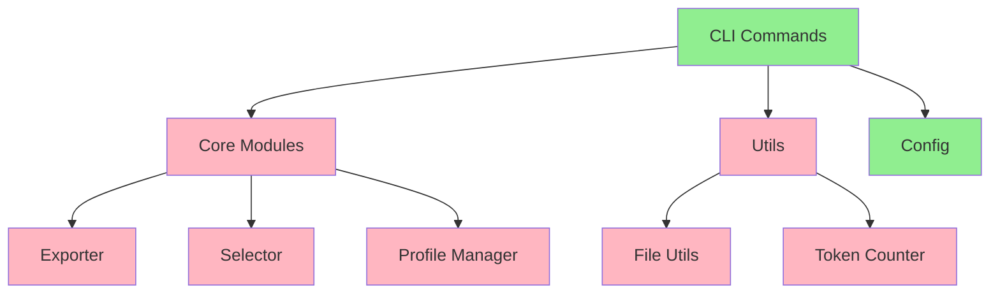

1# AI Context Manager MVP Status Report

**Date**: 2025-08-30  
**Review**: Current implementation vs. plan_mvp.md

## Executive Summary

The AI Context Manager has a solid foundation with working CLI structure and basic functionality, but has critical gaps in core data models and missing utility functions that prevent full operation.

## Phase-by-Phase Status

### ✅ Phase 1: Project Foundation & Core Structure
**Status**: **COMPLETED**

- ✅ Project structure matches plan exactly
- ✅ `pyproject.toml` includes all required dependencies
- ✅ Virtual environment (`.venv/`) is present
- ✅ Basic files (`.gitignore`, `.env.example`, `README.md`) exist

### ⚠️ Phase 2: Core Data Models & Configuration
**Status**: **PARTIALLY COMPLETED**

- ✅ `config.py` has basic `Config` class for managing directories
- ❌ **CRITICAL**: `get_config_dir()` function missing (import error in commands)
- ❌ `core/profile.py` data model not implemented
- ❌ `utils/file_utils.py` utility functions missing
- ❌ `utils/token_counter.py` implementation missing

### ✅ Phase 3: CLI Foundation with Typer
**Status**: **COMPLETED**

- ✅ Main CLI app (`cli.py`) implemented with Typer
- ✅ All command modules created and structured as sub-apps
- ✅ Basic command structure in place

### ⚠️ Phase 4: Profile Management
**Status**: **PARTIALLY COMPLETED**

- ✅ `commands/profile_cmd.py` implemented
- ❌ **MISMATCH**: Current implementation focuses on **export profiles** (filter settings) rather than **selection profiles** (file selections)
- ❌ Selection profile management (saving/loading file selections as named profiles) not implemented

### ⚠️ Phase 5: Export Functionality
**Status**: **PARTIALLY COMPLETED**

- ✅ `commands/export_cmd.py` fully implemented with markdown, XML, and JSON formats
- ❌ `core/exporter.py` core exporter module missing
- ❌ `core/selector.py` file selection logic missing

### ❌ Phase 6: Enhanced Features
**Status**: **NOT STARTED**

- ❌ `utils/token_counter.py` is empty
- ❌ No interactive mode implementation
- ❌ No smart defaults (gitignore patterns, .aicontextignore support)

### ❌ Phase 7: Testing & Quality
**Status**: **NOT STARTED**

- ❌ No `tests/` directory exists
- ❌ No test files or test fixtures

### ✅ Phase 8: Documentation & Polish
**Status**: **COMPLETED**

- ✅ Comprehensive `README.md` with installation, usage examples, and configuration details
- ✅ CLI help implemented through Typer's built-in help system

## Critical Issues

### 1. Import Error
**Severity**: HIGH
- Multiple command files import `get_config_dir` from `config`, but this function doesn't exist
- **Files affected**: `add_cmd.py`, `list_cmd.py`, `remove_cmd.py`, `profile_cmd.py`, `export_cmd.py`

### 2. Profile System Mismatch
**Severity**: MEDIUM
- Current implementation: Export profiles (filter settings for exports)
- Plan requirement: Selection profiles (saved file selections)
- **Impact**: Core functionality described in plan is not implemented

### 3. Missing Core Modules
**Severity**: HIGH
- `core/exporter.py`: Core export logic missing
- `core/selector.py`: File selection logic missing
- `core/profile.py`: Profile data models missing
- `utils/file_utils.py`: File utilities missing
- `utils/token_counter.py`: Token counting missing

## Current MVP Status

### Working Features
- CLI structure with Typer
- Basic command routing
- Configuration directory management
- Basic file operations (add, list, remove)

### Non-Working Features
- File selection and filtering
- Export functionality (missing core modules)
- Profile management (mismatched implementation)
- Token counting
- Interactive mode

## Next Steps Priority

1. **Fix import error** - Add `get_config_dir()` function to `config.py`
2. **Implement missing core modules** - `exporter.py`, `selector.py`, `profile.py`
3. **Implement file utilities** - `file_utils.py`, `token_counter.py`
4. **Add testing infrastructure** - Create `tests/` directory and basic tests
5. **Reconcile profile system** - Align with plan requirements or update plan

## Architecture Diagram

**Legend**:
- 🟢 Green: Completed
- 🟡 Yellow: Partially completed
- 🔴 Red: Not started
- 🔴 Pink: Missing implementation